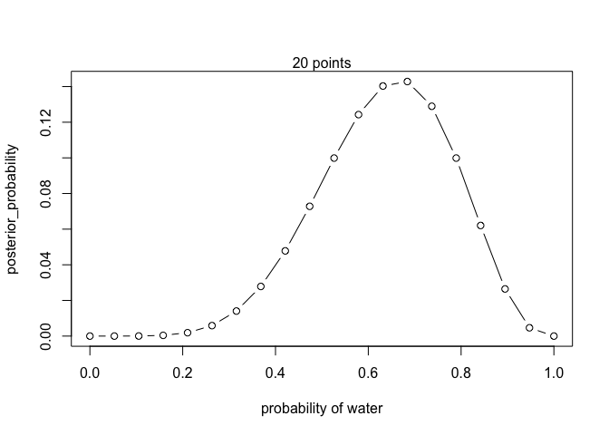
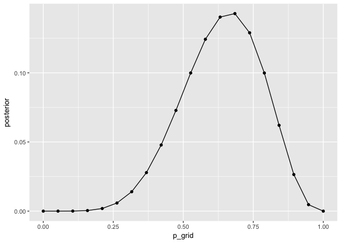
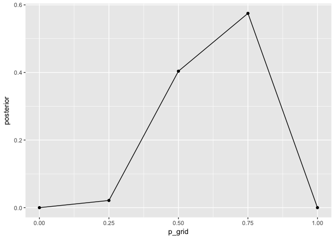
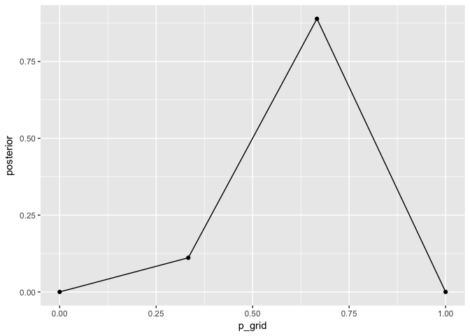
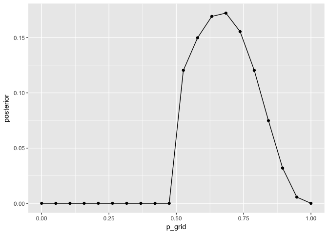
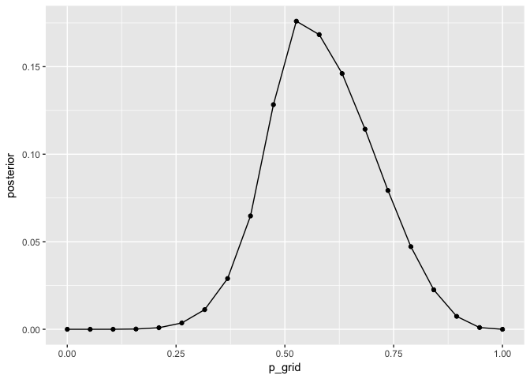

# Highlights

> Bayesian analysis provides a general way to discover relevant information and process it logically. Just don't think that it is the only way.

> In order to make good inference about what actually happened, it helps to consider everything that could have happened.

> ... if there are important differences between the model and reality, then there is no logical gaurantee of large world performance. ... even if the two worlds did match, any particular sample of data could still be misleading...keep in mind two principles: (1) A model's certainty is no gaurantee that the model is a good one, (2) it is important to supervise and critique your model's work.

> It is important to check the model's inferences in light of aspects of the data it doe not know about. Such checks are an inherently creative interprise, left to the analyst and the scientific community. Golems are very bad at it.

> ... The likelihood maps each conjecture - such as a proportion of water on the globe - onto the relative number of ways the data could occur, given that possibility...the likelihood needs to tell you the probability of any possible observation, for any psosible state of the (small) world, such as a proportion of water on a globe...Just keep in mind that the job of the likelihood is to tell us the realtive number of ways to see the data, given [values for parameters].

> Data are measured and known; parameters are unknown and must be estimated from data.

> ... none of this should be understood to mean that any statistical analysis is not inherently subjective, because of course it is - lots of little subjective decisions are involved in all parts of science. It's just that priors and Bayesian data analysis are nomore inherently subjective than are likelihoods and the repeat sampling assumptions required for significance testing.

In the summary:

> > ...a Bayesian model is a composite of a likelihood, a choice of parameters, and a prior. The likelihood provides the plausibility of an observation (data), given a fixed value for the parameters. The prior provides the plausibility of each possible value of the parameters, before accounting for the data.

# Grid approximation


```r
# define grid

p_grid <- seq(from = 0, 
              to = 1, 
              length.out = 20)

p_grid
```

```
##  [1] 0.00000000 0.05263158 0.10526316 0.15789474 0.21052632 0.26315789
##  [7] 0.31578947 0.36842105 0.42105263 0.47368421 0.52631579 0.57894737
## [13] 0.63157895 0.68421053 0.73684211 0.78947368 0.84210526 0.89473684
## [19] 0.94736842 1.00000000
```

```r
# define prior

prior <- rep(1,20)

prior
```

```
##  [1] 1 1 1 1 1 1 1 1 1 1 1 1 1 1 1 1 1 1 1 1
```

```r
# compute likelihood at each value in the grid

likelihood <- dbinom(6, 
                     size = 9, 
                     prob = p_grid)

likelihood
```

```
##  [1] 0.000000e+00 1.518149e-06 8.185093e-05 7.772923e-04 3.598575e-03
##  [6] 1.116095e-02 2.668299e-02 5.292110e-02 9.082698e-02 1.383413e-01
## [11] 1.897686e-01 2.361147e-01 2.666113e-01 2.714006e-01 2.450051e-01
## [16] 1.897686e-01 1.179181e-01 5.026670e-02 8.853845e-03 0.000000e+00
```

```r
# compute product of likeligood and prior
unstd_posterior <- likelihood * prior

unstd_posterior
```

```
##  [1] 0.000000e+00 1.518149e-06 8.185093e-05 7.772923e-04 3.598575e-03
##  [6] 1.116095e-02 2.668299e-02 5.292110e-02 9.082698e-02 1.383413e-01
## [11] 1.897686e-01 2.361147e-01 2.666113e-01 2.714006e-01 2.450051e-01
## [16] 1.897686e-01 1.179181e-01 5.026670e-02 8.853845e-03 0.000000e+00
```

```r
# standarfize posterior, so it sums to 1
posterior <- unstd_posterior / sum(unstd_posterior)

posterior
```

```
##  [1] 0.000000e+00 7.989837e-07 4.307717e-05 4.090797e-04 1.893887e-03
##  [6] 5.873873e-03 1.404294e-02 2.785174e-02 4.780115e-02 7.280739e-02
## [11] 9.987296e-02 1.242643e-01 1.403143e-01 1.428349e-01 1.289433e-01
## [16] 9.987296e-02 6.205890e-02 2.645477e-02 4.659673e-03 0.000000e+00
```

Now we plot it using base


```r
plot(p_grid,
     posterior,
     type = "b",
     xlab = "probability of water",
     ylab = "posterior_probability")
mtext("20 points")
```

<!-- -->

Now let's wrap that in a function


```r
grid_approx_binom_water <- function(n_grids){
  
p_grid <- seq(from = 0, 
              to = 1, 
              length.out = n_grids)

p_grid
# define prior

prior <- rep(1,n_grids)

prior
# compute likelihood at each value in the grid

likelihood <- dbinom(6, 
                     size = 9, 
                     prob = p_grid)

likelihood
# compute product of likeligood and prior
unstd_posterior <- likelihood * prior

unstd_posterior
# standarfize posterior, so it sums to 1
posterior <- unstd_posterior / sum(unstd_posterior)

data.frame(posterior = posterior,
           p_grid = p_grid)
}

plot_grid_approx <- function(posterior_samples,
                             p_grid){
plot(x = p_grid,
     y = posterior_samples,
     type = "b",
     xlab = "probability of water",
     ylab = "posterior_probability")
mtext("20 points")
}

library(tidyverse)
```

```
## ── Attaching packages ────────────────────────────────────────────── tidyverse 1.2.1.9001 ──
```

```
## ✔ ggplot2 2.2.1     ✔ purrr   0.2.4
## ✔ tibble  1.4.2     ✔ dplyr   0.7.4
## ✔ tidyr   0.8.0     ✔ stringr 1.3.0
## ✔ readr   1.1.1     ✔ forcats 0.3.0
```

```
## ── Conflicts ────────────────────────────────────────────────────── tidyverse_conflicts() ──
## ✖ dplyr::filter() masks stats::filter()
## ✖ dplyr::lag()    masks stats::lag()
```

```r
plot_posterior <- function(data){
  ggplot(data,
         aes_string(x = "p_grid",
                    y = "posterior")) + 
  geom_point() + 
  geom_line()
}

grid_approx_binom_water(20) %>% plot_posterior()
```

<!-- -->

```r
grid_approx_binom_water(5) %>% plot_posterior()
```

<!-- -->

```r
grid_approx_binom_water(4) %>% plot_posterior()
```

<!-- -->

Now, to replicate the different priors in Figure 2.5, try these lines of code - one at a time - for the prior grid:


```r
grid_approx_binom_water <- function(n_grids,
                                    p_grid = seq(from = 0, 
                                                 to = 1, 
                                                 length.out = n_grids),
                                    prior = rep(1,n_grids)){
  
# p_grid <- seq(from = 0, to = 1, length.out = n_grids)
# define prior

# prior <- rep(1,n_grids)

# compute likelihood at each value in the grid

likelihood <- dbinom(6, 
                     size = 9, 
                     prob = p_grid)

# compute product of likeligood and prior
unstd_posterior <- likelihood * prior

# standarfize posterior, so it sums to 1
posterior <- unstd_posterior / sum(unstd_posterior)

data.frame(posterior = posterior,
           p_grid = p_grid)
}

grid_approx_binom_water(n_grids = 20)
```

```
##       posterior     p_grid
## 1  0.000000e+00 0.00000000
## 2  7.989837e-07 0.05263158
## 3  4.307717e-05 0.10526316
## 4  4.090797e-04 0.15789474
## 5  1.893887e-03 0.21052632
## 6  5.873873e-03 0.26315789
## 7  1.404294e-02 0.31578947
## 8  2.785174e-02 0.36842105
## 9  4.780115e-02 0.42105263
## 10 7.280739e-02 0.47368421
## 11 9.987296e-02 0.52631579
## 12 1.242643e-01 0.57894737
## 13 1.403143e-01 0.63157895
## 14 1.428349e-01 0.68421053
## 15 1.289433e-01 0.73684211
## 16 9.987296e-02 0.78947368
## 17 6.205890e-02 0.84210526
## 18 2.645477e-02 0.89473684
## 19 4.659673e-03 0.94736842
## 20 0.000000e+00 1.00000000
```

```r
grid_approx_binom_water(n_grids = 20,
                        prior = ifelse(p_grid < 0.5, 0, 1)) %>%
  plot_posterior()
```

<!-- -->

```r
grid_approx_binom_water(n_grids = 20,
                        prior = exp(-5 * abs(p_grid-0.5))) %>%
  plot_posterior()
```

<!-- -->

# Quadratic approximation


```r
# install.packages("rethinking")
library(rethinking)
```

```
## Loading required package: rstan
```

```
## Loading required package: StanHeaders
```

```
## rstan (Version 2.17.3, GitRev: 2e1f913d3ca3)
```

```
## For execution on a local, multicore CPU with excess RAM we recommend calling
## options(mc.cores = parallel::detectCores()).
## To avoid recompilation of unchanged Stan programs, we recommend calling
## rstan_options(auto_write = TRUE)
```

```
## 
## Attaching package: 'rstan'
```

```
## The following object is masked from 'package:tidyr':
## 
##     extract
```

```
## Loading required package: parallel
```

```
## rethinking (Version 1.59)
```

```
## 
## Attaching package: 'rethinking'
```

```
## The following object is masked from 'package:purrr':
## 
##     map
```

```r
globe_qa <- rethinking::map(
  alist(w ~ dbinom(9, p),
        p ~ dunif(0,1)),
  data = list(w = 6)
)

rethinking::precis(globe_qa)
```

```
##   Mean StdDev 5.5% 94.5%
## p 0.67   0.16 0.42  0.92
```

